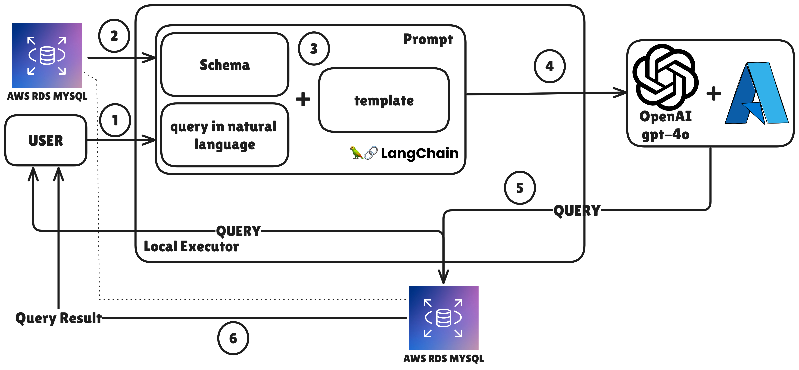

# Talk-to-DB: Querying Databases Using Natural Language

This project allows you to interact with a database using natural language queries, which are converted into SQL using LangChain and Azure OpenAI. The project leverages a Python environment to set up a connection with an RDS MySQL database and execute queries generated from user input.

## Project Setup

This repository is structured as a standard Python project. It uses a virtual environment (`.venv`) for managing dependencies.

### The Database Setup

To set up the virtual environment:

1. Clone the repository and navigate to the project directory.
2. Create a virtual environment:

   ```bash
   $ python3 -m venv .venv
3. Activate the virtual environment:

   ```bash
   $ source .venv/bin/activate
4. Install the required dependencies:

    ```bash
    $ pip install -r requirements.txt
5. Deploy the necessary resources using AWS CDK:

    ```bash
    $ cdk bootstrap
    $ cdk deploy
6. After deployment is complete, use the endpoint to set the environment variable:

    ```bash
    $ export DB_HOST="talktodbstack-example.us-east-1.rds.amazonaws.com"
7. To load the data into the database, follow the instructions in the following link: [Employee Database Installation](https://dev.mysql.com/doc/employee/en/employees-installation.html)
8. After extracting the data use the following command to load it to the DB:

    ```bash
    $ mysql -h $DB_HOST -P 3306 -u admin -p -t < employees.sql
  
### The model deployment

For this project, I utilized the Azure OpenAI service with a deployed model named gpt-4o-mini.

To set up your environment, export the required API key and endpoint in your terminal:

    ```bash
    $ export AZURE_OPENAI_API_KEY="<your-azure-openai-api-key>"
    $ export AZURE_OPENAI_ENDPOINT="<your-azure-openai-endpoint>"


